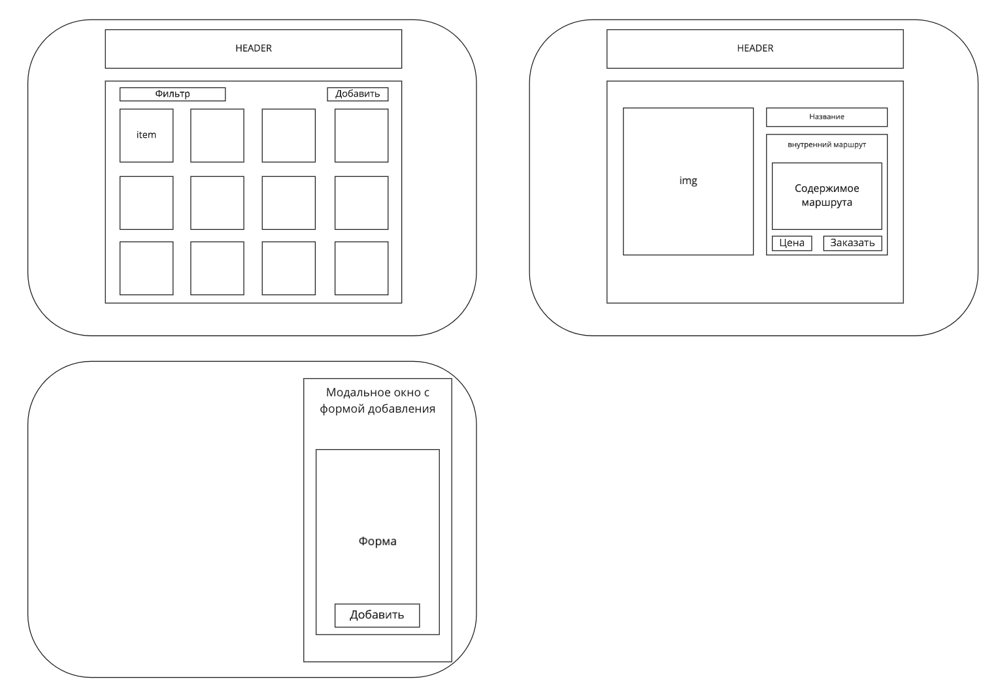

# rent-a-car
# Задание


### Уровень 1
+ Сверстать страницу выбора транспортного средства.
+ Сверстать детальную страницу транспортного средства.
+ Реализовать мобильную версию

>**Пояснения:**
>
>- Каждая детальная страница должна иметь свой адрес.
>- Переключение между типами информации (Specifications, Team, Rent terms) строится на основе вложенных маршрутов.
>- В фильтре по типу выпадающий список стилизовать не нужно. Это должен быть нативный селект.

### Уровень 2
+ Интегрировать взаимодействие с api. 
+ Для всех страниц осуществить связку с данными, полученными из api.
+ На страницу выбора транспортного средства реализовать фильтр по типу.

>**Пояснения:**
>
>- В приложении к тестовому заданию есть архив `api`, содержащий два файла: vehicles.json и request.js. Перед загрузкой приложения необходимо предварительно загрузить данных с помощью метода getVehicles из request.js. Результат работы функции getVehicles сохраняется в хранилище Vuex. Метод getVehicles может вернуть ошибку с вероятностью 1/3. В этом случае ошибку необходимо обработать.
>- На странице выбора транспортного средства, данные каждой карточки должны браться из объекта соответствующего т.с.
>- На детальной странице транспортного средства из объекта соответствующего т.с. должны браться: заголовок, описания для трех вкладок, цена и изображение. Вся остальная информация хардкодиться.

### Уровень 3
+ Реализовать форму добавления нового транспортного средства.
+ Реализовать переключение между светлой и темной темами.

>**Пояснения:**
>
>- После добавления нового транспортного средства, оно помещается в хранилище и отображается на странице выбора. Тип добавляемого транспортного средства должен быть `custom`.


# Выполненеи работы

Предварительно разложил макет на компоненты
>UPD. В процессе работы были внесены корректировки


## Project setup
```
npm install
```

### Compiles and hot-reloads for development
```
npm run serve
```

### Compiles and minifies for production
```
npm run build
```

### Lints and fixes files
```
npm run lint
```
